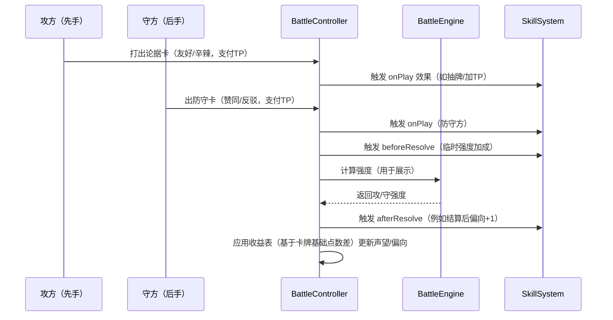

# 《宅理论战》核心战斗规则 V5.0

## 第一部分：总体规则与战场设定

### 1. 游戏概述与胜利条件

#### 1.1 游戏主题
《宅理论战》是一场**动漫文化辩论对决**。双方玩家各自率领一支"宅学辩论队"，通过引用动画作品作为论据，运用角色的辩论技巧，在激烈的唇枪舌战中击败对手。

#### 1.2 双重胜利条件
```
【主要胜利条件：声望系统】
- 初始声望：双方各30点
- 声望归零：任一方声望降至0点，立即败北
- 回合上限：12回合结束时，声望更高者获胜

【辅助胜利条件：议题偏向系统】
        反方 ←────────[●]────────→ 正方
              -10    -5    0    +5    +10

- 初始位置：中立（0）
- 每次辩论交锋后根据结果移动
- 到达±10时，该方直接获胜
- 提供另一种获胜路径，鼓励激进打法
```

### 2. 辩论团队构成

#### 2.1 团队配置
```
【标准配置】
每支辩论队包含：
┌─────────────────────────────────┐
│    辩手阵容：4名角色            │
├─────────────────────────────────┤
│ • 一辩/主辩手（1名）- 当前发言人 │
│ • 二三四辩（3名）- 候补辩手      │
├─────────────────────────────────┤
│    论据卡组：30张动画作品卡      │
└─────────────────────────────────┘
```

#### 2.2 角色技能设计

**技能配置规则**
```
【每个角色拥有】
1. 被动光环（Passive Aura）- 部分角色拥有
2. 主动技能（Active Skill）- 所有角色拥有

【使用限制】
- 主辩手：可使用主动技能 + 被动光环生效
- 候补辩手：仅被动光环生效（如果有）
- 被动光环设计原则：效果温和，避免叠加过强
```

**技能示例**
```
【SSR角色】凉宫春日
被动光环："SOS团的氛围"
- 全队使用日常系卡牌时+1强度

主动技能："不可思议探索"（3TP，冷却3回合）
- 本回合打出的下一张卡视为任意类型

【SR角色】夜神月
被动光环：无

主动技能："完美推理"（4TP，冷却4回合）
- 查看对手3张手牌，本回合辛辣点评额外+2强度

【R角色】阿虚
被动光环：无

主动技能："吐槽之力"（2TP，冷却2回合）
- 下次防守时，反驳成本-1TP
```

#### 2.3 轮换机制
```
【强制轮换规则】
- 每使用一次主动技能后，自动轮换下一位角色成为主辩手
- 轮换顺序：一辩→二辩→三辩→四辩→一辩（循环）
- 战略要点：需要合理安排角色出场顺序

【轮换时机】
- 技能使用后的下个己方回合开始时生效
- 被轮换下场的角色技能进入冷却
```

### 3. 战场布局

#### 3.1 界面分区优化
```
┌──────────────────────────────────────────────┐
│                【对方阵地】                   │
│  ┌──────────────────────────────────────┐   │
│  │         手牌展示区（6张卡牌）           │   │
│  └──────────────────────────────────────┘
│  ┌──────────────────────────────────────┐   │
│  │  [一辩★] [二辩] [三辩] [四辩]        │   │
│  │   CD:0    CD:2   CD:0   CD:1         │   │
│  └──────────────────────────────────────┘   │
│     声望：25  TP：6/6  手牌：5              │
├──────────────────────────────────────────────┤
│              【辩论交锋区】                   │
│  ┌────────────────────────────────┐ ┌─────┐│
│  │                                  │ │ 议  ││
│  │   [攻方论据]  ⚔️  [守方应对]        │ │ 题  ││
│  │                                  │ │ 偏  ││
│  │      强度：7  vs  强度：5          │ │ 向  ││
│  │                                  │ │     ││
│  │   最近交锋：[历史1][历史2][历史3]    │ │ ↑+3 ││
│  └────────────────────────────────┘   │  ●  ││
│                                       │ ↓-2 ││
├──────────────────────────────────────────────┤
│                【我方阵地】                   │
│  ┌──────────────────────────────────────┐   │
│  │  [一辩] [二辩★] [三辩] [四辩]           │   │
│  │   CD:3   CD:0    CD:1   CD:0         │   │
│  └──────────────────────────────────────┘   │
│     声望：28  TP：4/5  手牌：6                 │
│  ┌──────────────────────────────────────┐   │
│  │         手牌展示区（6张卡牌）            │   │
│  └──────────────────────────────────────┘   │
└──────────────────────────────────────────────┘

★ = 当前主辩手
CD = 技能冷却回合数
```

### 4. 回合流程

#### 4.1 先后手机制（轮流制）
```
【轮流先手规则】
- 奇数回合（1,3,5,7,9,11）：玩家A先手
- 偶数回合（2,4,6,8,10,12）：玩家B先手

【先手含义】
- 先手方：发起辩论，提出观点
- 后手方：应对辩论，反驳或赞同

【平衡性】
- 双方各有6次先手机会
- 确保公平的进攻主动权
```

#### 4.2 标准回合结构
```
┌─────────────────────────────────────┐
│  第N回合流程（最多12回合）            │
├─────────────────────────────────────┤
│ 1. 回合开始阶段                      │
│    • TP恢复：获得N+1点（上限13）     │
│    • 抽卡：从牌库抽1张              │
│    • 技能冷却：所有技能CD-1         │
│    • 检查轮换：如需要则切换主辩手    │
│    • 触发"回合开始"效果             │
├─────────────────────────────────────┤
│ 2. 先手方行动阶段                    │
│    可执行以下行动直到TP耗尽：       │
│    • 发起辩论（打出论据卡）         │
│    • 使用主辩手技能                │
│    • 查看信息                      │
│    • 主动结束                      │
├─────────────────────────────────────┤
│ 3. 后手方行动阶段                    │
│    • 必须应对所有辩论              │
│    • 可在应对间隙使用技能          │
├─────────────────────────────────────┤
│ 4. 回合结束阶段                      │
│    • 触发"回合结束"效果             │
│    • 交换先后手                     │
└─────────────────────────────────────┘
```

### 5. 核心资源系统

#### 5.1 TP（Talk Points）调整
```
【获取规则（12回合制）】
第1回合：2TP（上限2）
第2回合：3TP（上限3）
第3回合：4TP（上限4）
...
第12回合：13TP（上限13）

【消耗用途】
- 打出论据卡：1-4TP（卡面标注）
- 选择策略：友好+0/辛辣+1
- 使用技能：2-5TP
- 防守反驳：额外+1TP

【游戏节奏】
- 前期（1-4回合）：资源稀缺，谨慎交锋
- 中期（5-8回合）：战术展开，技能博弈
- 后期（9-12回合）：资源爆发，决战时刻
```

#### 5.2 手牌管理
```
【基础规则】
- 初始手牌：5张
- 手牌上限：10张
- 回合抽卡：1张
- 特殊抽卡：通过效果获得

【战略价值】
- 卡牌匹配：决定防守策略
- 资源储备：为连续进攻做准备
- 心理博弈：手牌数量形成威慑
```

### 6. 辩论交锋机制

#### 6.1 单次交锋流程
```
【完整流程】
1. 先手方发起
   - 选择论据卡 → 支付基础TP
   - 选择方式（友好/辛辣）→ 支付额外TP
   
2. 后手方应对
   - 选择应对卡 → 支付基础TP
   - 选择态度（赞同/反驳）→ 支付额外TP
   
3. 结算
   - 计算双方强度
   - 结算声望变化
   - 移动议题偏向
   - 触发额外效果
   
4. 继续或结束
   - 先手方决定是否继续进攻
```

#### 6.2 连续辩论机制
```
【连击规则】
- 一回合内可多次发起辩论
- 每次需等待对方应对
- 最多连续4次

【疲劳递减】
第1次：100%强度
第2次：-1强度
第3次：-2强度
第4次：-3强度

【中断机制】
- 完美反驳（强度差≥5）
- 立即终止先手方进攻
- 反驳方获得额外奖励
```

### 7. 特殊机制

#### 7.1 议题偏向详解
```
【偏向值计算】
- 攻方大胜（强度差≥4）：偏向+2
- 攻方小胜（强度差1-3）：偏向+1
- 平局（强度差0）：偏向不变
- 守方小胜（强度差1-3）：偏向-1
- 守方大胜（强度差≥4）：偏向-2

【偏向效果】
偏向值+5以上：该方所有论述+1强度
偏向值+8以上：该方所有论述+2强度
偏向值达到+10：该方直接获胜

【战略意义】
- 提供另一条获胜路径
- 鼓励连续进攻建立优势
- 落后方需要强力反击扭转局势
```

#### 7.2 角色羁绊系统
```
【团队羁绊】
同作品2人：初始声望+2
同作品3人：TP恢复+1
同作品4人：解锁专属团队技

同声优2人：技能冷却-1
同类型3人：特定类型卡牌成本-1

【羁绊限制】
- 最多激活2种羁绊
- 羁绊效果不可叠加
```

### 8. 时间限制

```
【操作时限】
- 每个决策：60秒
- 警告提示：剩余15秒

【超时处理】
先手方超时：自动结束回合
后手方超时：自动选择赞同（最低成本）

【暂停机制】
- 每方每局可暂停1次
- 暂停时长：60秒
```

### 9. 数据参考

#### 9.1 资源消耗参考
```
【论据卡成本】
R卡：1TP
SR卡：2TP
SSR卡：3TP
HR卡：4TP
UR: 5TP

【技能成本】
基础技能：2-3TP
强力技能：4-5TP
终极技能：6-7TP
```

#### 9.2 游戏时长预估
```
平均每回合：2-3分钟
标准对局：20-30分钟
快速模式：10-15分钟（可选8回合制）
```

---

## 第二部分：详细交锋规则（待续）

### 1. 双轨制核心理念

#### 1.1 系统定位差异
```
【声望系统】
- 代表：辩论的实际说服力
- 特点：变化相对平稳，重在积累
- 策略：稳扎稳打，控制风险

【议题偏向系统】  
- 代表：在特定议题上的立场主导权
- 特点：变化剧烈，可快速翻转
- 策略：激进进攻，抢占先机
```

#### 1.2 策略选择差异
```
友好安利 → 主打声望，温和推进议题
辛辣点评 → 主打议题，激烈争夺立场
赞同 → 保护声望，放弃议题争夺
反驳 → 争夺议题，声望风险较大
```

### 2. 重构版收益表

#### 2.1 完整收益对照表

<table>
<thead>
<tr>
<th rowspan="2">强度差</th>
<th colspan="3">友好安利</th>
<th colspan="3">辛辣点评</th>
</tr>
<tr>
<th>声望变化</th>
<th>议题偏向</th>
<th>额外效果</th>
<th>声望变化</th>
<th>议题偏向</th>
<th>额外效果</th>
</tr>
</thead>
<tbody>

<tr>
<td colspan="7" align="center"><strong>守方选择：赞同</strong></td>
</tr>

<tr>
<td><strong>攻方压制<br>(差值≥5)</strong></td>
<td>攻+1<br>守-4</td>
<td>攻方+2</td>
<td>守方+1抽卡</td>
<td>攻+0<br>守-6</td>
<td>攻方+3</td>
<td>守方+1抽卡<br>守方+1TP</td>
</tr>

<tr>
<td><strong>攻方优势<br>(差值1-3)</strong></td>
<td>攻+3<br>守±0</td>
<td>攻方+1</td>
<td>守方+1抽卡</td>
<td>攻+1<br>守-1</td>
<td>攻方+2</td>
<td>守方+1抽卡</td>
</tr>

<tr>
<td><strong>势均力敌<br>(差值0)</strong></td>
<td>攻+2<br>守+1</td>
<td>不变</td>
<td>双方友好氛围</td>
<td>攻+1<br>守±0</td>
<td>攻方+1</td>
<td>-</td>
</tr>

<tr>
<td><strong>守方优势<br>(差值-1~-3)</strong></td>
<td>攻+1<br>守+1</td>
<td>不变</td>
<td>守方+1抽卡</td>
<td>攻-1<br>守+1</td>
<td>攻方+1</td>
<td>攻方+1TP</td>
</tr>

<tr>
<td><strong>守方压制<br>(差值≤-4)</strong></td>
<td>攻±0<br>守+2</td>
<td>不变</td>
<td>守方+2抽卡</td>
<td>攻-2<br>守+2</td>
<td>不变</td>
<td>攻方+2抽卡</td>
</tr>

<tr>
<td colspan="7" align="center"><strong>守方选择：反驳</strong></td>
</tr>

<tr>
<td><strong>攻方压制<br>(差值≥4)</strong></td>
<td>攻+2<br>守-2</td>
<td>攻方+1</td>
<td>守方"动摇"</td>
<td>攻+1<br>守-3</td>
<td>攻方+2</td>
<td>守方"动摇"</td>
</tr>

<tr>
<td><strong>攻方优势<br>(差值1-3)</strong></td>
<td>攻+1<br>守-1</td>
<td>不变</td>
<td>-</td>
<td>攻±0<br>守-2</td>
<td>攻方+1</td>
<td>-</td>
</tr>

<tr>
<td><strong>势均力敌<br>(差值0)</strong></td>
<td>攻±0<br>守±0</td>
<td>守方+1</td>
<td>激烈交锋</td>
<td>攻-1<br>守+1</td>
<td>守方+2</td>
<td>守方"气势"</td>
</tr>

<tr>
<td><strong>守方优势<br>(差值-1~-3)</strong></td>
<td>攻-1<br>守+2</td>
<td>守方+1</td>
<td>守方"气势"</td>
<td>攻-2<br>守+1</td>
<td>守方+3</td>
<td>守方"气势"</td>
</tr>

<tr>
<td><strong>守方压制<br>(差值≤-4)</strong></td>
<td>攻-2<br>守+3</td>
<td>守方+2</td>
<td>攻方"动摇"</td>
<td>攻-3<br>守+2</td>
<td>守方+4</td>
<td>攻方"动摇"<br>守方+1抽卡</td>
</tr>

<tr>
<td><strong>完美反驳<br>(差值≤-5)</strong></td>
<td>攻-3<br>守+4</td>
<td>守方+2</td>
<td>中断连击<br>守方+2抽卡</td>
<td>攻-2<br>守+3</td>
<td>守方+5</td>
<td>中断连击<br>立即转换议题</td>
</tr>

</tbody>
</table>

### 3. 策略差异分析

#### 3.1 友好安利 vs 辛辣点评

```
【友好安利】
优势：
- 声望收益稳定且高
- 失败时损失较小
- 容易形成友好氛围

劣势：
- 议题偏向变化小
- 难以快速建立议题优势
- 无法快速压制对手

适用场景：
- 声望领先时巩固优势
- 资源不足时的安全选择
- 试探对手手牌
```

```
【辛辣点评】
优势：
- 议题偏向变化大
- 可以快速抢占议题主导权
- 成功时心理压制强

劣势：
- 声望收益较低
- 需要额外TP成本
- 失败时损失较大

适用场景：
- 需要快速推进议题偏向
- 手握强力卡牌时
- 追求议题偏向胜利
```

#### 3.2 赞同 vs 反驳

```
【赞同】
效果特点：
- 大幅承认对方议题立场（议题偏向变化大）
- 声望损失可控
- 获得资源补偿

战略价值：
- 当议题偏向不重要时的明智选择
- 积累资源等待反击
- 破坏对手节奏
```

```
【反驳】
效果特点：
- 主要争夺议题偏向
- 声望变化剧烈
- 成功后获得主动权

战略价值：
- 阻止对手议题偏向胜利
- 扭转议题局势
- 展现强硬立场
```

### 4. 双轨制战术指南

#### 4.1 声望流打法
```
【核心思路】
- 以友好安利为主
- 稳定积累声望优势
- 不追求议题偏向

【卡组构筑】
- 高强度卡牌为主
- 角色选择重防守
- 技能偏向声望保护

【对局策略】
- 对手辛辣点评时选择赞同
- 用资源优势拖垮对手
- 声望领先后转入防守
```

#### 4.2 议题流打法
```
【核心思路】
- 以辛辣点评为主
- 快速推进议题偏向
- 10回合内结束战斗

【卡组构筑】
- 中等强度但数量多
- 角色选择激进型
- 技能增强议题推进

【对局策略】
- 连续辛辣点评施压
- 迫使对手反驳消耗资源
- 议题+7后全力冲刺
```

#### 4.3 平衡打法
```
【核心思路】
- 根据局势切换策略
- 双线威胁对手
- 保持灵活性

【卡组构筑】
- 卡牌强度分布均匀
- 角色能力全面
- 技能可攻可守

【对局策略】
- 开局试探对手倾向
- 中期建立一项优势
- 后期二择压制
```

### 5. 议题偏向特殊规则

#### 5.1 议题偏向加成
```
偏向值 ±3：该方向所有论述+1强度
偏向值 ±5：该方向所有论述+2强度  
偏向值 ±7：该方向获得每回合+1TP
偏向值 ±9：该方向所有技能CD-1
偏向值 ±10：该方直接获胜
```

#### 5.2 议题转换机制
```
【自然转换】
- 每4回合更换议题
- 议题偏向保留50%（向0靠拢）

【强制转换】
- 完美反驳触发
- 特定技能效果
- 议题偏向完全重置
```

### 6. 实战案例分析

#### 案例一：声望流 vs 议题流
```
第6回合
A方（声望流）：声望22，议题-3
B方（议题流）：声望18，议题+6

B方策略：连续辛辣点评，押注议题胜利
A方应对：全部赞同，保护声望，积累资源

结果预测：
- 如果B方3回合内推到+10，B胜
- 如果A方撑过议题转换，A方资源优势胜
```

#### 案例二：双线压制
```
第8回合  
攻方：声望25，议题+4
守方：声望15，议题-4

攻方选择：
方案A：友好安利，稳定推进声望
方案B：辛辣点评，冲击议题胜利

关键判断：
- 守方手牌数量
- 守方TP储备
- 技能冷却情况
```

---

这样重新设计后：
- **友好安利**注重声望，议题变化小
- **辛辣点评**注重议题，声望收益低  
- **赞同**虽然让出议题，但保护声望
- **反驳**主要争夺议题，声望风险大

两条获胜路径now有了明显区别，玩家需要在"稳健的声望战"和"激进的议题战"之间做出选择。

---

## 附录：当前实现规则（V5.0 代码对照）

> 本节说明当前前端实现的「实际生效」规则，便于与设计文档对齐与迭代。若与上文设计存在差异，以本节为准（后续会逐步收敛）。

### A. 回合与资源（TurnManager）
- 回合开始（先后手轮流）：
  - 同步双方最大 TP：`maxTp = 2 + (turn - 1)`。
  - 先手方 TP 恢复至 `maxTp`；后手方获得 `ceil(maxTp/2)` 的 TP（上限不超过 `maxTp`）。
  - 先手方抽 1 张牌。
  - 所有技能冷却 `-1`。
  - 若标记了轮换，则切到下一个主辩手。
  - 阶段进入 `action`。

- 胜负判定（任何状态变更后检查）：
  - 声望 ≤ 0：对方胜。
  - 议题偏向 ≥ +10（A 方）或 ≤ -10（B 方）：即时胜利。
  - 满 12 回合未分胜负：比较声望高者胜；相同则平局。

### B. 出牌与支付（BattleController）
- 进攻：打出 anime 卡时支付 `卡牌cost +（辛辣点评? +1 : +0）`。
- 防守：应对时支付 `卡牌cost +（反驳? +1 : +0）`。
- 「打出时 onPlay」效果：在双方出牌各自触发（例如：抽 1、获得 TP 等）。

### C. 强度计算（StrengthCalculator + 效果）
- 基础强度：`finalStrength = card.points`（来自卡数据的 `points` 字段）。
- 议题偏向加成：
  - 若当前 `topicBias > 0`，A 方出牌时额外 `+topicBias`；
  - 若 `topicBias < 0`，B 方出牌时额外 `+|topicBias|`。
- 被动光环示例：`AURA_GENRE_EXPERT` 当出牌卡含“日常”标签时 `+1` 强度。
- 结算前（beforeResolve）临时加成：例如 `STRENGTH_PLUS_1/2` 会在当次交锋前注入到攻/守方强度（用于展示）。

> 注意：当前收益计算（声望/议题）仍使用「卡牌基础点数差值」而非上述「最终强度」。这会造成展示强度与收益依据不完全一致（后续将统一）。

### D. 结算收益（RewardCalculator）
- 若无防守（未出卡）：
  - 声望变化：攻方 `+ceil(attackingCard.points/2)`，守方相反为负值。
  - 议题变化：辛辣点评 `+2`，友好安利 `+1`（方向以攻方为正向，即 A 方为 `+`，B 方为 `-`）。

- 若有防守：
  - 使用「基础点数差值」`diff = 攻方card.points - 守方card.points` 分类：
    - `diff ≥ 4`：攻方压制
    - `1 ≤ diff ≤ 3`：攻方优势
    - `diff = 0`：势均力敌
    - `-3 ≤ diff ≤ -1`：守方优势
    - `diff ≤ -4`：守方压制
    - 特例「完美反驳」：`diff ≤ -5`
  - 根据「攻方策略（友好/辛辣）」与「守方选择（赞同/反驳）」套用上文收益表（已在文档第 2 部分“重构版收益表”列出），并以攻方方向作为议题偏向的正负方向（A 方为 `+`，B 方为 `-`）。

### E. 动画卡与角色卡的效果/技能（SkillSystem）
- Anime 卡面效果：
  - `effects` 可在 onPlay/beforeResolve/afterResolve 触发，例如：
    - `DRAW_1` 抽 1。
    - `GAIN_TP_1/2` 获得 TP。
    - `STRENGTH_PLUS_1/2` 结算前临时强度加成。
    - `TOPIC_BIAS_PLUS_1` 结算后议题偏向向己方 `+1`。
  - 若未配置独有 `effects`，按稀有度注入默认效果：
    - R：打出时 抽 1；SR：打出时 +1 TP；SSR：结算前 +1 强度；HR：结算后 议题偏向 +1。

- Character 技能：
  - 主动技能通过 `useSkill` 调用具体 `effectId` 实现（如抽牌/加 TP/改变偏向）。
  - 被动光环在强度计算与事件阶段生效（如类型加成）。
  - 若未配置独有技能，按稀有度注入默认：
    - N：主动 抽 1，被动 类型专家；R：主动 +2 TP，被动 类型专家；SR：主动 抽 1，被动 类型专家；SSR/HR/UR：示例见实现（可继续细化）。

### F. 交锋流程（当前实现）



### G. 与设计差异（待统一）
- 结算依据：当前收益表使用「卡牌基础点数差」，尚未纳入被动、偏向、临时加成后的「最终强度」。
- 连续辩论的疲劳递减、中断连击与议题自然/强制转换等机制：文档已有设计，代码暂未实装。
- 计时/超时与暂停：文档已有设计，代码暂未实装。

> 建议后续里程碑：将 RewardCalculator 的输入从「基础点数差」切换为 BattleEngine 的「最终强度差」，并逐步补齐连击/转换等机制，以与本章设计完全一致。